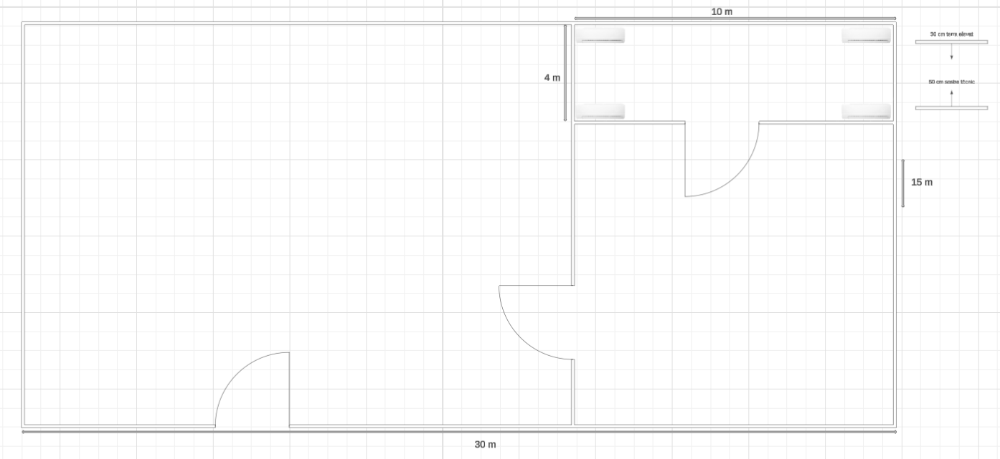

Memoria Proyecto
# Índice
- [Introducción](#introducción)
- [Instalación](#instalación)
- [Uso básico](#uso-básico)
- [Conclusión](#conclusión)

---

# Proposta de CPD – Detall Tècnic

## Ubicació física

### Situació física de la sala a l’edifici
- **Ubicació:** Planta baixa, zona central.
- **Condicions:** Sense finestres visibles des de l’exterior.
- **Proximitat:** A prop del quadre elèctric i de l’entrada tècnica per facilitar manteniment.

### Mesures per dificultar la identificació de la sala
- Porta sense rètols.
- Accés exclusiu amb dades biomètriques.
- Sensor de moviment per personal autoritzat.

### Dimensions
- **Sala principal:** 30 x 15 m  
- **Sala de servidors:** 10 x 4 m

---

## Sistemes de climatització

- **Tipus:** Sistemes redundants d’aire condicionat tipus In-Row.
- **Temperatura:** 20–22 °C.
- **Humitat relativa:** 40–55%.
- **Neteja de l’aire:** Filtratge de partícules i neteja regular de pols.

---

## Infraestructura física

### Terra tècnic i sostre tècnic
- **Terra elevat:** 30 cm.
- **Sostre tècnic:** 50 cm (facilita ventilació i cablejat).

### Distribució i gestió del cablejat
- Passat per sota del terra tècnic.
- Separat en canals per seguretat i manteniment.

---

## Estructuració dels racks

### Rack 1
- Servidors
- Switch core

### Rack 2
- Patch panels
- Switches d’accés
- Sistemes de comunicació

---

## Infraestructura IT

### Servidors
- **3 x Dell PowerEdge R750**
  - 2U
  - 2 x Intel Xeon Silver
  - 128GB RAM
  - 2TB SSD

### Patch Panels
- **2 x Patch panels** de 24 ports RJ45 Cat6

### Switches
- **2 x Cisco Catalyst 9200** (redundància)
- **VLANs separades:** serveis, gestió, usuaris, backups

---

## Infraestructura elèctrica

### Sistemes d’alimentació redundant
- **Connexió a dues línies elèctriques independents**
- **Grup electrogen** de suport automàtic

### SAIs
- **2 x APC Smart-UPS 3000VA**
- **Càlcul de consum:**
  - 3 servidors x 500W = 1500W
  - 6000VA disponibles → autonomia estimada: **15-20 minuts**

---

## Seguretat física i lògica

### Física

#### Control d’accés
- Porta amb:
  - Targeta
  - Codi
  - Registre biomètric (doble factor)

#### Videovigilància
- **3 càmeres IP 4K**

#### Incendis
- Sensors de fum i gas
- Sistema d’extinció amb gas inert

#### Vies d’evacuació
- Porta d’emergència
- Senyalització LED

---

### Lògica

#### Accés restringit
- Mitjançant **Active Directory/LDAP**

#### Firewalls
- FortiGate o pfSense amb accés VPN segur

#### Monitorització
- Zabbix o Prometheus (estat, temperatura, tràfic, etc.)

#### Còpies de seguretat
- Backup diari incremental
- Backup setmanal complet
- Còpies locals i al núvol

#### RAIDs
- RAID 5 en servidors i NAS

---

## Prevenció de riscos laborals

- Senyalització clara de riscos
- Extintors i kits de primers auxilis
- Il·luminació d’emergència
- Informació de riscos al personal tècnic
- Política de no accés sense calçat dielèctric

---

## Sostenibilitat

### Optimització del consum energètic
- Servidors amb fonts **80 Plus Platinum**
- **Contracte amb proveïdor elèctric 100% renovable**
- Centralització d’equips per **estalvi de cablejat**
- **Fluxos d’aire controlats** amb sensors
- **Parada automàtica** d’equips en períodes inactius
- **Equips de baix consum:** switches i servidors amb mode d’estalvi

---

## CPD al núvol – AWS

### Serveis utilitzats
- **EC2:** màquines virtuals per a servidors
- **S3:** emmagatzematge de còpies de seguretat
- **RDS:** base de dades administrada
- **CloudWatch:** monitorització i alertes

### Comparativa d’eficiència energètica

| Proveïdor       | Eficiència energètica | Fonts d’energia           | Certificacions                        | Preus               |
|-----------------|------------------------|----------------------------|----------------------------------------|----------------------|
| **AWS**         | Alta                   | 100% renovables (2025)     | ISO 27001, ISO 50001                   | Competitius          |
| **Azure**       | Alta                   | Neutralitat 2030           | ISO 27001                              | Variables per zona   |
| **Google Cloud**| Molt Alta              | 100% renovable             | LEED, ISO                              | Competitius          |

---

## Planells i diagrames

> S'inclouran com a annexos visuals:
- Distribució física de la sala
- Racks amb servidors, switches i patch panels
- Infraestructura elèctrica i cablejat
- Sistemes de climatització i seguretat

## Instalación
Aquí va el contenido de la instalación...

## Uso básico
Aquí va el contenido del uso básico...

## Conclusión
Aquí va la conclusión...
