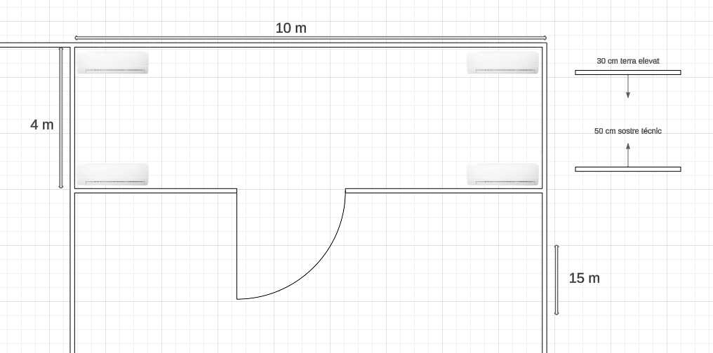

# Memoria Proyecto

## Proposta CPD

### Ubicació física
Situació física de la sala a l’edifici.  
La sala CPD s’ubicarà a la planta baixa, en una zona central sense finestres visibles des de l’exterior, a prop del quadre elèctric i de l’entrada tècnica per facilitar el manteniment.

### Sistemes de climatització (aire condicionat). Nivells de temperatura, humitat i neteja de l’aire.
- Sistemes redundants d’aire condicionat tipus In-Row.  
- Temperatura: 20–22 °C.  
- Humitat relativa: 40–55%.  
- Filtratge de partícules i neteja regular de pols.

## Mesures per dificultar la identificació de la sala.
Porta sense rètols, accés exclusiu via dades biomètrics i targeta d’identificació. 

### Distribució i gestió del cablejat.
Passat per sota de terra tècnic, separat en canals.

### Terra tècnic i sostre tècnic.
Terra elevat de 30 cm i sostre tècnic de 50 cm per facilitar ventilació i cablejat.

---

### Estructuració dels racks (mínim 2 racks).
- Rack 1: servidors.  
- Rack 2: switches, patch panel.

### Infraestructura IT:
#### Servidors: Número i tipus de model.
3 x Dell PowerEdge R750 (2U, 2 x Intel Xeon Silver, 128GB RAM, 2TB SSD).

#### Patch panels.
1 x patch panels de 24 ports RJ45 Cat6.

#### Switches.
2 x Cisco Catalyst 9200 (redundància).  
VLANs separades per serveis, gestió, usuaris i backups.

### Planells i diagrames de com estan distribuïts els racks amb els servidors, patch panels i switches.

---

### Infraestructura elèctrica:
#### Sistemes d’alimentació redundant.
- Connexió a dues línies elèctriques independents.  
- Grup electrogen de suport automàtic (generador).

#### SAIS. Càlcul de quantes bateries o components per tenir els servidors operatius sense corrent elèctric i temps que voleu de funcionament sense senyal elèctric en els servidors.
- 2 x APC Smart-UPS 3000VA.  
- Càlcul: 3 servidors x 500W = 1500W.  
- Amb 6000VA disponibles, autonomia estimada de 15-20 minuts per apagada controlada.

---

### Seguretat física i lògica:

#### Física:
- Elements de control d’accés a incorporar en el CPD.  
- Porta amb targeta, codi i registre biomètric (doble factor).

#### Videovigilància.
3 càmeres IP 4K

#### Sistemes prevenció, detecció i d’extinció d’incendis.
Sensors de fum i gas, sistema d’extinció per gas inert.

#### Vies d’evacuació.
Porta d’emergència i senyalització LED.

#### Diagrames, planells i fotografies de tota la seguretat física incorporada.

---

#### Lògica:
- Restricció d’accés per autorització.  
- Mitjançant directoris (LDAP).

#### Firewalls.
FortiGate o pfSense amb VPN per gestió remota segura.

#### Monitorizació.
Zabbix o Prometheus per estat, temperatura, tràfic, etc.

#### Còpies de seguretat/Backups.
Backup diari incremental i setmanal complet.  
Còpies locals i al núvol.

#### RAIDs.
RAID 5 en servidors i NAS per redundància i tolerància a errors.

---

### Prevenció de riscos laborals:
- Mesures aplicades en matèria de prevenció de RRLL en el CPD  
- Senyalització clara de riscos.  
- Extintors i kits de primers auxilis.  
- Il·luminació d’emergència.  
- Informació de riscos al personal tècnic.  
- Política de no accés sense calçat dielèctric.

---

### Sostenibilitat:
#### Com optimitzar el consum d’energia.
- Servidors amb fonts 80 Plus Platinum.

#### Ús d’energia verda pel CPD.
- Contracte amb proveïdor elèctric 100% renovable.

#### Estalvi en longitud de cablejat.
- Centralització d’equips i racks.

#### Sistemes de circulació d’aire que aprofitin condicions naturals.
- Fluxos controlats per sensors.

#### Parada d’equips de comunicacions quan no hi ha càrrega.
- Gestió de potència automàtica en períodes inactius.

#### Equips de baix consum energètic.
- Switches i servidors amb mode d’estalvi.

---

## Implementació del CPD al núvol AWS amb els serveis utilitzats

Investigar i comparar eficiència energètica amb altres proveïdors del núvol. Com els diferents proveïdors ofereixen solucions de CPD administrats per aquestes empreses i com donen cobertura als requisits exposats anteriorment.

| Proveïdor     | Eficiència energètica | Fonts d’energia                  | Certificacions               | Preus                 |
|---------------|-----------------------|--------------------------------|-----------------------------|-----------------------|
| **AWS**       | Alta                  | 100% renovables (2025)          | CPD ISO 27001, ISO 50001    | Preus competitius     |
| **Azure**     | Alta                  | Neutralitat 2030                | ISO 27001                   | Preus variable segons zona |
| **Google Cloud** | Molt Alta           | 100% renovable                 | LEED, ISO                   | Preus competitius     |

---

### Servidor 1: Streaming d'Àudio
- Instal·lem el servei icecast2 i el configurem.
- Comprovem que la instal·lació ha estat correcta i no hi ha hagut cap error:

`/etc/icecast2/icecast.xml`  
Configurem el fitxer del servei:

- Verifiquem que el port 8000 estigui obert per al servei, si no ho activem amb  
`sudo ufw allow 8000/tcp`

- Accedim a l'índex de la web mitjançant la IP pública del server:  
`http://”IpPublica”:8000/index.html`

#### Panell d'administració del servei:

#### Configuració de targeta d'àudio:
- Instal·lem la imatge de Linux “linux-image-6.8.0-60-generic”:

- Comprovem que s'hagi instal·lat correctament:

- Forcem l'ús de la imatge al GRUB mitjançant `/etc/default/grub`

- Actualitzem el fitxer i reiniciem l'ordinador.

- Executem el servei i comprovem que la transmissió d'àudio sigui funcional mitjançant la ubicació configurada, el nostre cas  
`http://”IpPublica”:8000/live.mp3`

---

### Servidor 2: Streaming de Vídeo
- Instal·lem el servei nginx i el configurem:

- Comprovem que la configuració realitzada ha estat reeixida:

- Iniciem el servei i emetem un vídeo des del servidor.  
`ffmpeg -re -i /usr/local/nginx/html/prueba.mp4 -c:v libx264 -c:a aac -f flv rtmp://127.0.0.1:1935/live/test`

- Comprovem que el servei sigui funcional mitjançant el vostre URL per veure les estadístiques de la transmissió:  
`http://”IpPublica”:8080/stat`

- Ara comprovem que la transmissió sigui exitosa mitjançant el vostre URL per veure la transmissió:  
`http://”IpPublica”/stream.html`

---

### Servidor 3: Servicios adicionales del CPD

#### DNS(bind9)
- Instal·lem el servei de DNS i veiem l'estat

- Configurem el fitxer db:

#### DHCP
- Comprovem que el servei DHCP sigui funcional

- Configurem el dhcpd.conf:

#### FTP (vsftpd)
- Veiem que el servei ftp sigui exitós:

- Configurem el vostre fitxer vsftpd.conf:

- Proba de connexió al server FTP

#### Netdata
- Veiem l'estat de netdata

- Accedim a la web de monitorització mitjançant el seu URL:  
`http://IPpublica:19999/`

---

## Definició de taules

Primer hem creat la base de dades amb nom **innovate**.

Seguidament, hem creat les taules de cada un dels punts que demanen com són:

- **empleat**: per emmagatzemar les dades personals i laborals de cada treballador.
- **departament**: per identificar i gestionar les diferents àrees de l’empresa.
- **grup_nivell**: conté la classificació professional segons el conveni del sector (grup i nivell), així com salaris, període de prova i dies de vacances.

---

### Justificació

#### Empleat (DNI, nom, cognoms, adreça, telèfon, codi_departament, codi_grup)  
Aquesta taula conté tota la informació necessària dels treballadors. El camp DNI és clau primària, mentre que codi_departament i codi_grup són claus foranes.

#### Departament (codi, nom, telefon)  
Es defineixen vuit departaments diferents per cobrir totes les àrees claus de l’empresa. Això permet tenir una assignació clara per a cada empleat.

#### Grup_nivell (codi_grup, salari_total, periode_prova, dies_vacances)  
Aquesta taula s'ha creat per adaptar-nos al conveni del sector de consultoria i TI. Cada empleat té assignat un grup-nivell amb condicions específiques.

---

### Usuaris

#### Anna Grau (A1)
- **ROL:** Responsable de projectes
- **PERMISOS:** Accés complet a tota la base de dades (`GRANT ALL PRIVILEGES`)
- **Justificació:** Coordinadora general, necessita accés global.

#### Bernat Solé (B1)
- **ROL:** Consultor tècnic
- **PERMISOS:** `SELECT`, `INSERT`, `UPDATE` a la taula empleat
- **Justificació:** Ha de gestionar personal tècnic i veure informació dels empleats.

#### Berta Ferrer (B2)
- **ROL:** Tècnic de sistemes
- **PERMISOS:** `SELECT`, `INSERT`
- **Justificació:** Pot afegir i consultar informació però no editar-la.

#### Grups C, D i E
- Els permisos van decreixent progressivament segons nivell i responsabilitat.
- Es mantenen permisos limitats a consulta (`SELECT`) o sense accés si no es requereix.

---

### Explicació visual i creació de taules

En aquesta imatge podem veure com estem creant les taules i afegint el contingut que hauran de tenir cada una d’elles.

Aquí ensenyem les taules que tenim creades i primer, afegim els valors a la taula **grup_nivell**.

I aquí afegim el contingut de la taula **departament** i **empleat**.

---

### Vista taula empleats

Podem veure la taula d’empleats amb:

- El seu DNI (identificador)
- Direcció
- Telèfon
- codi_departament
- codi_grup (referència al departament i nivell assignat)

---

### Creació d'usuaris

Hem de crear l’usuari amb l’identificador, en aquest cas el seu DNI.

---

### Assignació de permisos

Afegim els permisos a cada usuari segons els permisos que tenen a l’empresa i la seva importància.

---

### Definició dels grups professionals

#### Grup A

Pertanyen a aquest grup professional les persones que, per coneixements i experiència professional, coordinen, planifiquen i gestionen els recursos disponibles a càrrec seu, vetllant per la consecució dels objectius perseguits. Realitzen aquestes activitats amb autonomia i capacitat de supervisió.

Les instruccions s'enuncien en termes generals, i han de ser interpretades i adaptades en gran manera, estant facultat per a fixar directrius, i per tot això, s'exigeix ineludiblement una gran aportació personal.

La responsabilitat per les seves decisions afecta directament o indirectament a part de l'organització, i, a més de poder implicar importants conseqüències econòmiques immediates, té importants efectes negatius en el funcionament de l'empresa.

En conseqüència, té accés i utilitza informació privilegiada, de la qual poden derivar-se conseqüències molt greus.

---

#### Grup B

Pertanyen a aquest grup professional les persones que tenen atribuïdes funcions relacionades amb l'anàlisi, definició, coordinació i supervisió de projectes, tasques, activitats pròpies del sector, línia, àrea a les quals pertany, vetllant per la consecució dels objectius perseguits, i que disposin de la necessària formació, coneixement i experiència professional.

Planifiquen i gestionen, per projecte, els recursos humans i tècnics disponibles. Desenvolupen les seves funcions amb autonomia i capacitat de supervisió mitjana-alta.

##### Nivell 1  
Persones amb el perfil professional adequat, amb experiència professional en les tasques del grup i que posseeixen els coneixements necessaris. Àmplia autonomia en l'execució de les seves tasques. Demostra iniciativa en les tasques assignades. Supervisa i assigna tasques a persones al seu càrrec.

##### Nivell 2  
Persones amb el perfil professional adequat, amb poca experiència professional en les tasques del grup i que posseeixen els coneixements necessaris. Actua amb autonomia en l'execució de les seves tasques. Aplica iniciativa en les tasques assignades. Supervisa i assigna tasques a persones al seu càrrec.

---

#### Grup C

Pertanyen a aquest grup professional les persones que realitzen activitats de tipus tècnic dins d'una àrea determinada de coneixement, i es responsabilitzen de la programació i supervisió d'activitats realitzades per col·laboradors interns o externs, i que disposin de la necessària formació, coneixement i experiència professional.

Organitzen i programen les activitats sota la seva responsabilitat, podent arribar a supervisar de manera pròxima l'activitat desenvolupada per les persones que componen els seus equips. Desenvolupen les seves funcions amb autonomia i capacitat de supervisió mitjana.

##### Nivell 1  
Compta amb els recursos i/o els coneixements necessaris i amb àmplia experiència professional en les tasques del grup. Pot impartir formació de processos i tècnica. Actua amb iniciativa en les tasques assignades. Desenvolupa la seva activitat amb autonomia en els processos assignats. Pot supervisar tasques de persones al seu càrrec.

##### Nivell 2  
Posseeixen els coneixements necessaris i experiència professional en les tasques del grup. Té coneixements de les tasques administratives o tècniques que realitza amb iniciativa, però sota una certa supervisió. Pot impartir formació tècnica. És autònom en l'execució tècnica de la feina de casa. Requereix poca supervisió en els processos. Proposa millores en els processos que se li assignen. Pot supervisar tasques de persones al seu càrrec.

##### Nivell 3  
Posseeixen els coneixements necessaris i compta amb poca experiència professional en les tasques del grup. Té coneixements de les tasques administratives o tècniques, que desenvolupa amb una certa iniciativa, però sota supervisió. Demostra autonomia en l'execució tècnica de la feina de casa. Pot supervisar tasques de persones al seu càrrec.

---

#### Grup D

Pertanyen a aquest grup professional les persones que executen els processos administratius i tècnic-operatius, amb un grau de complexitat mitjà, i que disposin de la necessària formació, coneixement i experiència professional. Pot supervisar tasques de persones al seu càrrec. Desenvolupen les seves funcions amb autonomia limitada.

##### Nivell 1  
Persones amb el perfil professional adequat, amb experiència professional en les tasques del grup i que posseeixen els coneixements necessaris. Fa tasques de complexitat mitjana i amb poca supervisió. Proposa millores en els processos que se li assignen, però sense comptar amb capacitat de decisió.

##### Nivell 2  
Posseeixen els coneixements necessaris i experiència professional en les tasques del grup. Fa tasques de complexitat mitjana que han de ser supervisades.

##### Nivell 3  
Posseeixen els coneixements necessaris i amb poca experiència professional en les tasques del grup. Fa tasques de complexitat mitjana, normalment estandarditzades i que han de ser supervisades.

---

#### Grup E

Pertanyen a aquest grup professional les persones que executen tasques tècniques i administratives de baixa complexitat subjectes a instruccions de treball, per formació, coneixement i experiència professional. Desenvolupen les seves funcions sense autonomia i sota supervisió.

##### Nivell 1  
Persones amb el perfil professional adequat que fan les tasques tècniques pròpies del seu grup amb complexitat baixa i sota supervisió i sense autonomia.

##### Nivell 2  
Persones amb el perfil professional adequat que fan tasques administratives, operatives o de gestió senzilles, sota supervisió i sense autonomia.

---

#### Durada període de prova

- Grup A: Sis mesos  
- Grup B: Sis mesos  
- Grup C: Quatre mesos  
- Grup D: Tres mesos  
- Grup E: Tres mesos  

**Vacances:** 23 dies laborables

---

## 4 Sostenibilitat

### Càlcul de la petjada ecològica del projecte realitzat:

#### 1- Identificar els recursos emprats, per exemple:

- **Quins serveis han desplegat (tipus de màquines, serveis de núvol, protocols):**  
  - Tipus de màquines: instàncies EC2 tipus t3.medium (1 vCPU, 1 GB RAM, 30 GB SSD).  
  - Sistema operatiu: Ubuntu Server 22.04 LTS.  
  - Servidor 1: Servei d’àudio.  
  - Servidor 2: Servei de vídeo.  
  - Servidor 3: DNS, DHCP, FTP, Servei de monitorització.

- **Quins recursos consumeixen (CPU, RAM, emmagatzematge, amplada de banda):**  
  - CPU: 1 vCPU per servidor → Total: 3 vCPU.  
  - RAM: 1 GB per servidor → Total: 3 GB RAM.  
  - Emmagatzematge: 30 GB SSD per instància → Total: 90 GB SSD.

- **Ample de banda estimat:**  
  - Per a streaming (vídeo/àudio): uns 4 GB/hora per servidor en hores punta.  
  - Altres serveis (web, FTP, DNS, etc.): uns 500 MB/hora per servidor.

- **Quina és la previsió d’ús (hores de funcionament, usuaris, tràfic estimat):**  
  - Hores de funcionament: 5 dies/setmana, 4 hores/dia → 20 h/setmana.  
  - Nombre d’usuaris estimats: 11 usuaris (grups A, B, C, D i E).

- **Tràfic estimat:**  
  - Streaming: 4 GB/hora × 4 h/dia × 5 dies = 80 GB/setmana  
  - Altres serveis: 1,5 GB/setmana  
  - **Total aproximat:** 81,5 GB/setmana

---

#### 2- Estimar el consum energètic i la petjada de carboni:

- **Estimar el consum energètic de:**  
  - Les instàncies del núvol (pot utilitzar valors aproximats o eines del proveïdor com la Carbon Footprint Calculator d'AWS o similars de GCP/Azure).  
  - El tràfic generat pel streaming (considerant, per exemple, watts per GB transferit).  
  - El consum dels servidors virtuals o serveis en funcionament contínuament.

- **Utilitzar factors d’equivalència per convertir energia (kWh) en emissions (kg CO2 eq.).**

##### Consum energètic estimat de les instàncies AWS

- Cada instància t3.medium consumeix aproximadament 25 W en ús mitjà.  
- Consum setmanal per instància: 25 W × 20 hores = 0,5 kWh/setmana  
- Total per 3 instàncies: 0,5 kWh × 3 = 1,5 kWh/setmana

##### Consum pel tràfic de streaming

- Mitjana de consum energètic per trànsit de dades (segons estimacions Cloud Carbon Footprint): 0,06 kWh/GB  
- Tràfic de streaming: 80 GB/setmana × 0,06 = 4,8 kWh/setmana

##### Consum total setmanal

| Element      | Consum (kWh) |
|--------------|--------------|
| Instàncies   | 1,5          |
| Streaming    | 4,8          |
| **Total**    | **6,3 kWh/setmana** |

##### Conversió a emissions de CO₂

- Regió AWS eu-east-1 (Norte de Virginia): 0,117 kg CO₂/kWh  
- 6,3 kWh × 0,117 kg CO₂/kWh = 0,737 kg CO₂/setmana  
- Petjada anual estimada = 0,737 × 52 = **38,4 kg CO₂/any**

---

#### 3- Proposta de mesures de reducció o optimització, per exemple:

- **Reduir hores de funcionament?**  
  - Automatitzar l’aturada de les màquines fora de l’horari lectiu mitjançant scripts o serveis com AWS Instance Scheduler.  
  - Executar serveis com el de vídeo només durant les hores pràctiques reals.

- **Utilitzar serveis amb energia renovable?**  
  - AWS opera amb un compromís públic de 100% d’energia renovable el 2025.  
  - S’ha seleccionat la regió eu-east-1, que ja treballa en gran part amb energia verda.

- **Triar regions de núvol més eficients?**  
  - A l’escenari futur, considerar regions amb millor eficiència energètica com Suècia o Finlàndia, amb energia hidràulica i refrigeració natural.  
    
---

Per tal de millorar encara més l'eficiència energètica del CPD, es pot comparar la regió escollida actualment (AWS eu-east-1) amb altres regions amb un impacte ambiental inferior. Segons dades públiques d’AWS i estudis de sostenibilitat, la regió eu-east-1 té una intensitat mitjana de carboni de 0,117 kg CO₂/kWh, mentre que la regió eu-north-1 (Estocolm, Suècia), alimentada gairebé exclusivament amb energia hidroelèctrica i amb refrigeració natural, pot reduir aquesta intensitat fins a 0,012 kg CO₂/kWh.

Això representaria una reducció potencial d’emissions de més del 89%, passant d’una petjada estimada de 38,4 kg CO₂/any a només 3,9 kg CO₂/any. Per tant, si bé la regió d’Estats Units ja és eficient, en futurs desplegaments es podria considerar l’ús de regions nòrdic-europees per minimitzar encara més l’impacte ambiental del CPD.
